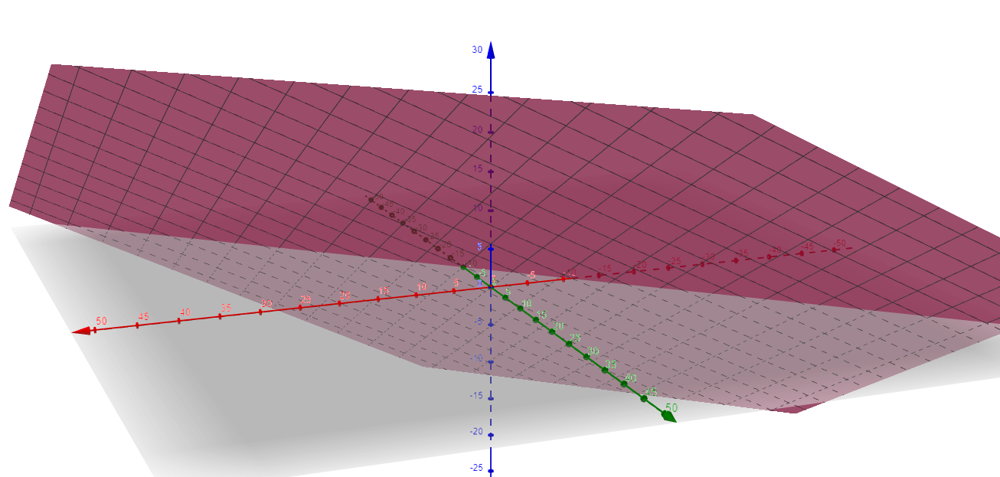
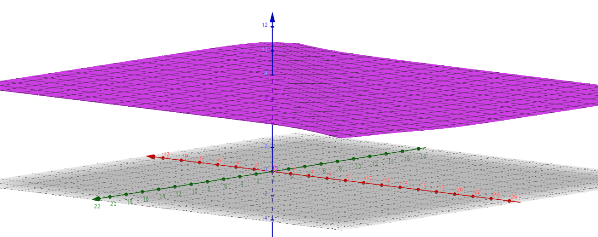
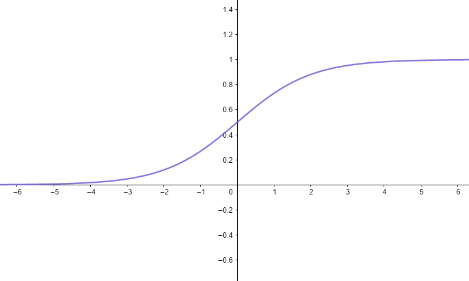
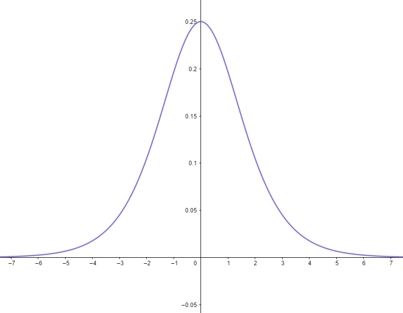
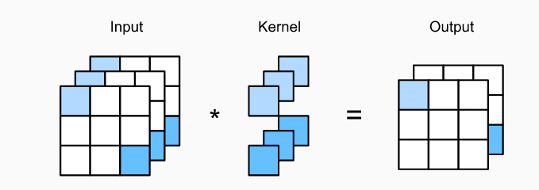
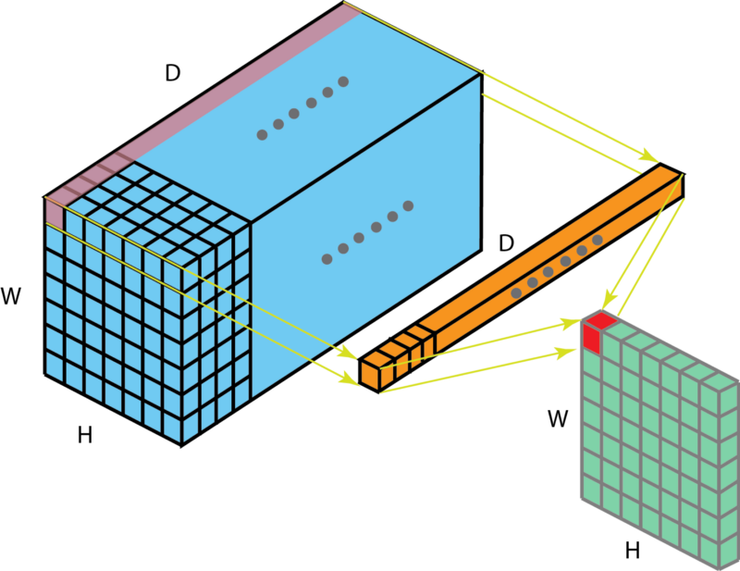
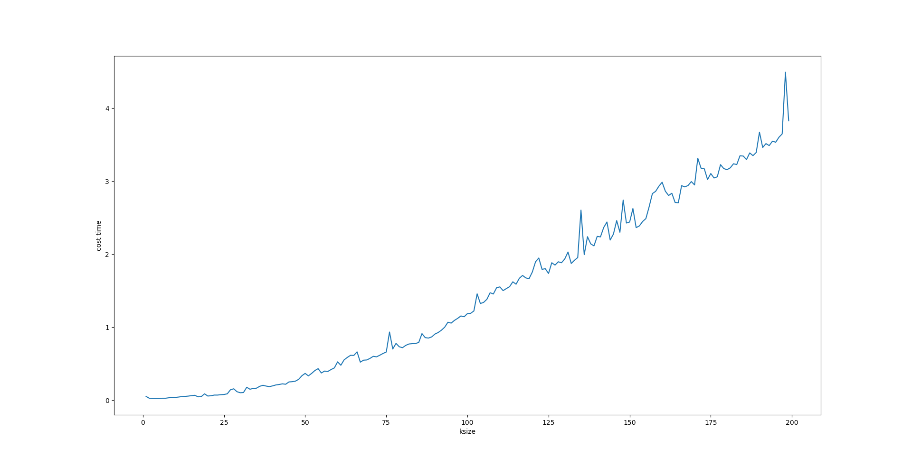

# Deep Learning Probelms

## 1. SGD为什么是个很好的方法[^1]

​		普通GD算法：
$$
w_{t+1}=w_t-\eta\bigtriangledown l(x_t)=w_t-\eta\bigtriangledown(x_t*w_t-\hat{y})
$$
​		GD算法每次都是通过整个数据集来计算损失函数的梯度这意味着如果数据集太大，那么梯度计算将会变得很慢，最后还只能走一小步，一般GD需要走很多步才能走完。

​		***使用整个训练集称为批量（batch），术语批量梯度下降（BGD）指使用全部数据集，当批量单独出现时指使用一组样本。* **

​		其次如果进入鞍点，或者比较差得全局最优点，因为这些点的导数为0，GD算法就跑不出来。


​		SGD算法：
$$
w_{t+1}=w_t-\eta\bigtriangledown g_t(w,b)
$$
​		$g_t$称为随机梯度，满足$E[g_t]=\bigtriangledown l(x_t)$,即虽然梯度包含一定的随机性，但是**从期望看，它是等于正确的导数（使用GD时的导数）。更大的批量拥有更精确的梯度估计。**

​		***每次只使用单个样本的优化算法称为随机或在线算法，从连续产生的样本数据流中抽取样本***

​	大多数用于深度学习的算法介于以上两者之间，使用一个以上而又不是全部的训练样本。**传统上，这些会被称为小批量 （minibatch）或小批量随机 （minibatch stochastic）方法，现在通常将它们简单地称为随机 （stochastic）方法。**

​	随机梯度下降法，不像BGD每一次参数更新，需要计算整个数据样本集的梯度，而是**每次参数更新时，仅仅选取一个样本计算其梯度。**

​		用一张图来表示，其实SGD就像是喝醉了酒的GD，它依稀认得路，最后也能自己走回家，但是走得歪歪扭扭．（红色的是GD的路线，偏粉红的是SGD的路线）．


 		  SGD（指mini batch SGD）由于在小批量的学习过程中加入了噪声，这些噪声会产生正则化的效果。

​		实践中，人们发现，除了算得快，SGD有非常多的优良性质．它能够自动逃离鞍点，自动逃离比较差的局部最优点，而且，最后找到的答案还具有很强的一般（generalization），即能够在自己之前没有见过但是服从同样分布的数据集上表现非常好！

​		

## 2. 激活函数

​		激活函数**给神经网络引入了非线性的能力，满足连续可导（条件性满足）。**

### 2.1 Introduction

​		如果没有激活函数：
$$
f_{11}(x_1,x1_2)=0.3*x_1+0.4*x_2+3\\
f_{12}(x_1,x_2)=0.6*x_1+0.6*x_2+2\\
f_{21}(f_11,f_12)=0.5*f_11+0.6f_12+3
$$
​		得到得图像是一个超平面，无法解决线性不可分问题。




​		加了激活函数的图像，使用sigmoid饱和函数激活：




使用的工具[^2]


### 2.2 一些常用的激活函数

### 2.2.1 梯度消失/梯度弥散的问题

​		sigmoid函数是一类**logistic函数，即不管输入是什么，得到的输出都在0到1之间。**
$$
sigmoid(x)=\frac{1}{1+e^{-x}}
$$


sigmoid这样的函数通常被成为**非线性函数，因为我们不能用线性的项来描述它。**很多激活函数都是非线性或者线性函数的组合。**在求梯度时候，sigmoid的导数为：**
$$
\frac{\partial{sigmoid}}{\part{x}}=\frac{e^{-x}}{(e^{-x}+1)^2}
$$


由此可见，**当梯度很大的时候，经过sigmoid函数后梯度将会变得接几乎为0。根据参数更新算法，梯度为0意味着不更新。**如果网络中有太多的这种情况则意味着网络只有细微的更新，网络就不会有多大的改善。

#### 2.2.2 ReLU及变种

​		**ReLU,** *** Rectified Linear Unit,整流线性单元。***
$$
ReLU=max(0,x)
$$
优点：ReLU延缓了梯度消失的问题，且由于其线性特点，训练快很多。

缺点：如果$x\leq0$，那么ReLU输出为0，梯度也为0，权重将不再更新，导致节点不再学习。

​		**Leaky ReLU**
$$
Leaky \ ReLU =max(0.1x,x)
$$

​	

## 3. Convolutional Neural Networks[^3]

### 3.1 from dense layer to convolutions

​		对于全连接，假设我们有一张100w像素的图片，则意味的网络的每个输入都有100w个维度。我们应该利用这样一个先验信息：相邻的像素是相互关联的（nearby pixels are typically related to each other）。

​		对于想要检测图像中的物体，我们不应该过分关注物体像素在图像中的精确位置。

​		我们可以根据以下条件来设计网络：

1. In the earliest layers, **our network should respond similarly to the same `patch`, regardless of where it appears in the image (translation invariance，平移不变性). **参数共享
2. The earliest layers of the network should  focus on local regions, without regard for the contents of the image in distant regions (locality). Eventually, these local representations can be aggregated to make predictions at the whole image level.**考虑局部，不考虑全部**

根据平移不变性，我们有：
$$
h[i,j]=\sum_{a,b}V[a,b]*x[i+a,j+b]\\
i,j表示像素坐标，a,b表示在像素上的正负偏移
$$
这个公式表明，我们**实际上是对像素[i,j]及其附近[i+a,j+b]范围内的像素用系数$V[a,b]$进行加权。**

根据位置性，我们不应该在离像素[i,j]很远的地方来计算h[i,j]的特征。这意味着，在**某个范围$|a|，|b|>\delta$之外。应该设置$V[a,b]=0。$**
$$
h[i,j]=\sum_{a=-\delta}^{\delta}\sum_{b=-\delta}^{\delta}
V[a,b]*x[i+a,j+b]
$$
上面公式就是一个卷积层。

对于三维图像，像素值可以由$x[i,j,k],k表示通道$唯一确定，所以，上面的公式可以改成
$$
h[i,j,k]=\sum_{a=-\delta}^{\delta}\sum_{b=-\delta}^{\delta}\sum_{c}V[a,b,c,k]*x[i+a,j+b,c]\\
c为卷积核输入通道，k为输出的通道（卷积核的个数）
$$
不同的通道可以学习到不同的局部特征，比如有的识别边缘，有的识别纹理。

**`2维卷积的实现:`**

```python
def CONV2d(X,K):
    """:param K为卷积核，X为输入
    """
    h,w=K.shape
    Y=torch.zeros((X.shape[0]-h+1,X.shape[1]-w+1)) #卷积核输出维度的计算公式
    for i in range(Y.shape[0]):
        for j in range(Y.shape[1]):
            Y[i,j]=torch.sum(X[i:i+h,j:j+h]*K)#广播机制
            #从左往右，从上往下的顺序在数组上滑动。
    return Y
```

二维卷积层将**输入和卷积核做互相关运算**，并加上一个**标量偏差**来得到输出。在卷积网络中，我们通常**先对卷积核随机初始化，然后通过迭代更新卷积核和偏差。**

可以通过torch框架定义：

```python
class conv2d(nn.Module):
    def __inint__(self,kernel_size):
        super(conv2d,self).__init__()
        self.weight=nn.Parameter(torch.rand(kernel_size))
        self.bias=nn.Parameter(torch.zeros(1))
        #nn.Parameter是Tensor的子类
        
     def forward(self,x)
    	return CONV2D(x,self.weight)+self.bias
        
```

卷积核的参数学习

```python
# Construct a convolutional layer with 1 input channel and 1 output channel
# (channels will be introduced in the following section)
# and a kernel array shape of (1, 2). For sake of simplicity we ignore bias
conv2d = nn.Conv2d(1,1, kernel_size=(1, 2), bias=False)

#二维卷积的输入和输出是(N,C,H,W)格式
X = X.reshape((1, 1, 6, 8))
Y = Y.reshape((1, 1, 6, 7))

for i in range(10):
    Y_hat = conv2d(X)
    l = (Y_hat - Y) ** 2 #损失函数
    conv2d.zero_grad()
    l.sum().backward() #损失BP
    conv2d.weight.data[:] -= 3e-2 * conv2d.weight.grad #梯度下降更新
    if (i + 1) % 2 == 0:
        print(f'batch {i+1}, loss {l.sum():.3f}')
```

### 3.2 1*1 Convolution Layers

​		1x1卷积运算**主要在通道变换上**，宽和高基本无变化。如下图，输入3x3x3的矩阵，卷积核为1x1x3个数为2，输出为3x3x2。，**输出元素维不同通道相同位置像素值按权重累加**。假设我们将通道维当作特征维（**从通道的方向看，下下图**），将高和宽维度上的元素当成数据样本(D个样本，W*H个batch？)，那么1×1卷积层的作用与全连接层等价。即下图中浅蓝色的三个通道相连了。如果用全连接类比的话，一个卷积核相当于一个节点。





1x1卷积可以用来**1.调整网络层之间的通道数来控制模型复杂度。**

​								 **2. 实现跨通道的交互和信息的整合**

​		**网络中的网络(NiN)**


https://zh.gluon.ai/chapter_convolutional-neural-networks/nin.html

https://d2l.ai/chapter_convolutional-modern/nin.html

### 3.3 Receptive Field （感受场）

​		在卷积神经网络中，**每个卷积网络从上一层的一些位置（和卷积核大小相关）接受输入**，全连接中，每个神经元接受前一层的**每个元素输入**。神经元输入区域称为感受场，在全连接中，感受场就是前一层网络，在卷积网络中，感受场比前一层小。


### 3.4 Pooling 层

​		**池化层的提出是为了缓解卷积层对位置的过度敏感性**

​		实际图像里，我们感兴趣的物体不会总出现在固定位置：即使我们连续拍摄同一个物体也极有可能出现像素位置上的偏移。这会导致同一个边缘对应的输出可能出现在卷积输出`Y`中的不同位置，进而对后面的模式识别造成不便。

我的理解：不同对象的像素值总是与其他对象相差较远（相关性小），使用池化可以去除不属于同一个对象的像素值。

### 3.5 Modern Convolutional Neural Network

#### 3.5.1 AlexNet

​		AlexNet使用了8层卷积神经网络（5个卷积层，3个全连接层），**首次证明了*学习到的特征可以超越手工设计的特征***。

```python
net=nn.Sequential(
    nn.Conv2d(1,96,kernel_size=11,stride=4,padding=1),nn.ReLU(),
    nn.MaxPool2d(kernel_size=3,stride=2),
    nn.Conv2d(96,256,kernel_size=5,padding=2),nn.ReLU(),
    nn.MaxPool2d(kernel_size=3,stride=2),
    nn.Conv2d(256,384,kernel_size=3,padding=1),nn.ReLU(),
    nn.Conv2d(384,384,kernel_size=3,padding=1),nn.ReLU(),
    nn.Conv2d(384,384,kernel_size=3,padding=1),nn.ReLU(),
    nn.Conv2d(384,256,kernel_size=3,padding=1),nn.ReLU(),
    nn.MaxPool2d(kernel_size=3,stride=2),

    nn.Flatten(),
    nn.Linear(6400,4096),nn.ReLU(),
    nn.Dropout(p=0.5),
    nn.Linear(4096,10)
)

X=torch.randn(1,1,224,224)
for layer in net:
    X=layer(X)
    print(layer.__class__.__name__,"output shape:\t",X.shape)

```

`AlexNet`首次在CNN中运用了，`ReLU`,`Dropout`,`多GPU同时计算`等现在常用的trick。除了将图片从中心裁剪成统一大小和将图像中的每个像素值除以均值外没做其他任何预处理。

**ImageNet是一个拥有超过1500万个已标记高分辨率图像的数据集，大约有22000个类别。**


#### 3.5.2 VGG

​		在同样的stride下， 不同的卷积核大小的特征图和卷积**参数量**相差不大；

​		越大的聚集和**计算量**越大。


### 3.5  不同卷积核大小对运算时间的影响




[^1]: https://zhuanlan.zhihu.com/p/27609238

[^2]: https://www.geogebra.org/3d

[^3]: https://d2l.ai/chapter_convolutional-neural-networks/why-conv.html

