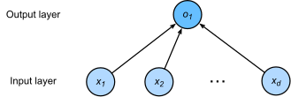

# Divid into Deep Learning 

## 3 Linear Regerssion

​		线性回归是一个连续值，与回归问题不同，分类问题输出的是一个离散值。

​		Regression refers to a set of methon for modeling the relationship between one or more independent and a dependent variable.(一个或或多个自变量于一个因变量之间的关系。)

### 3.1 Basic Elements of Linear Regression

$Y=Xw$

- training data,training set 
- example,data instance ,data point,sample
- label,target
- features ,covariates(independent vaiable X)
- offset,intercept(b)

whatever instruments we use to observe the features X and labels y might suff small amount if measurement error.Thus, even when we are confident that the underlying relationship is linear, we will incorporate a noise term to account for such errors.

无论我们怎么测量，只要，$1\leq{i}\leq{n}$，$i$ 是samples个数，$n$是真实数据全集，得到的数据总是不能反映真实数据的情况。**所以我们无论用什么工具来观察特征X和标签y，都可能得到少量的测量误差。因此，我们会加入一些噪声项来考虑这些误差。**

we training the model ,and we want to find $w^*,b^*$ that minimize the total loss across all training examples:
$$
w^*,b^*=argmin_{w,b}L(w,b)
$$
Linear regression happens to be an unusually simple optimization problem. Unlike most other models that we will encounter in this book, linear regression can be solved analytically by applying a simple formula, yielding a global optimum.

**线性模型是一类非常简单的线性模型，不像其它的模型，线性模型可以用最小二乘法求出最优解。**
$$
w^*=(X^TX)^{-1}y
$$


**mini batch SGD(stochastic gradient descent),小批次随机梯度下降**

1. 在每次迭代过程中，我们首先从训练样本中随机采样一个minibatch 大小的数据；
2. 接着我们通过模型的参数计算minibatch上模型一个样本的loss的梯度
3. 最后，我们将梯度于事先设置好的学习率相乘（$\eta>0$）然后监狱当前参数（W）的值

数学描述如下：
$$
(w,b)\gets(w,b)-\frac{\eta}{|B|}\sum_{i\in B}\frac{\part l^i(w,b)}{\part(w,b)}\\l=wx+b，i指该批次的第i个样本
$$

```python

# 定义一个函数，每次返回batch_size个随机样本和标签
def data_iter(batch_size,x,labels):
    labels=labels
    batch_size=batch_size
    x=x
    num_exampls_=len(x)
    # 生成索引
    indices=list(range(num_exampls_))
    # 打乱生成的索引，使生成的样本数据顺序随机
    random.shuffle(indices)
    for i in range(0,num_exampls_,batch_size):
        j=torch.tensor(indices[i:min(i+batch_size,num_exampls_)])
        # print(j)
        yield x[j],labels[j]
```


**Neural Network Diagram**



**Note that these diagram indicate the connectivity pattern,but not the values taken by then weights or biases.**It indiacte the data stream。

fully-connected layer can also called dense layer.


### 3.2  Concise Implementaion of Linear Regression

我们使用DataLoader加载数据，DataLoader返是一个迭代器类型，通过迭代器类来访问。

```python
def load_array(data_arrays, batch_size, is_train=True):  #@save
    """Construct a PyTorch data loader"""
    dataset = data.TensorDataset(*data_arrays)
    return data.DataLoader(dataset, batch_size, shuffle=is_train)

batch_size = 10
data_iter = load_array((features, labels), batch_size)

print(next(iter(data_iter)))#访问第一个batch的数据，可以用for循环遍历完
```

https://d2l.ai/chapter_linear-networks/linear-regression-concise.html


## 6. Convolutional Neural Networks

$$
input:(N,C_{in},H_{in},W_{in})\\
output:(N,C_{out},H_{out},W_{out})\\
H_{out}=[\frac{H_{in}+2*padding[0]-dilation[0]*(kernel_size[0]-1)-1}{stride[0]}+1]\\
W_{out}=[\frac{W_{in}+2*padding[1]-dilation[1]*(kernel_size[1]-1)-1}{stride[1]}+1]
$$

