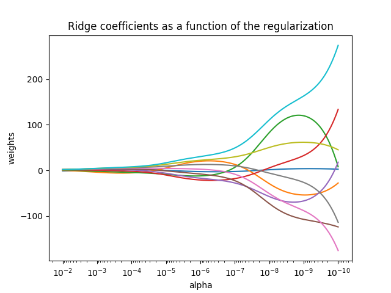
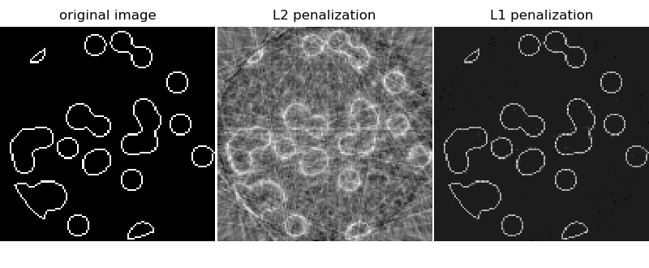
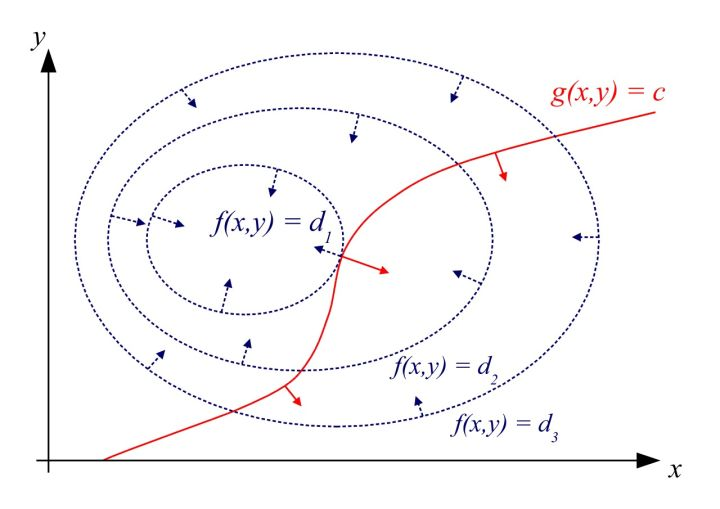
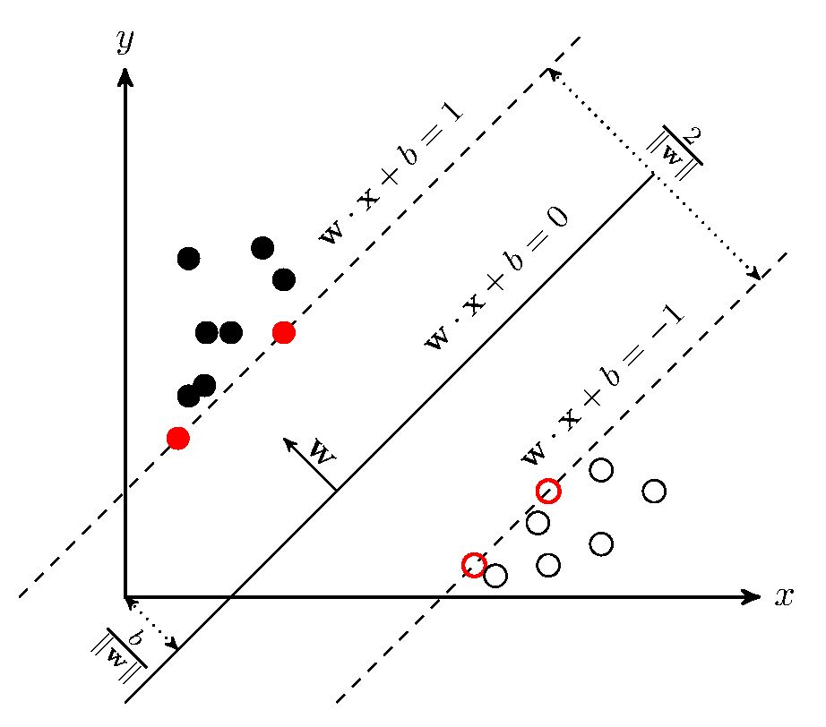
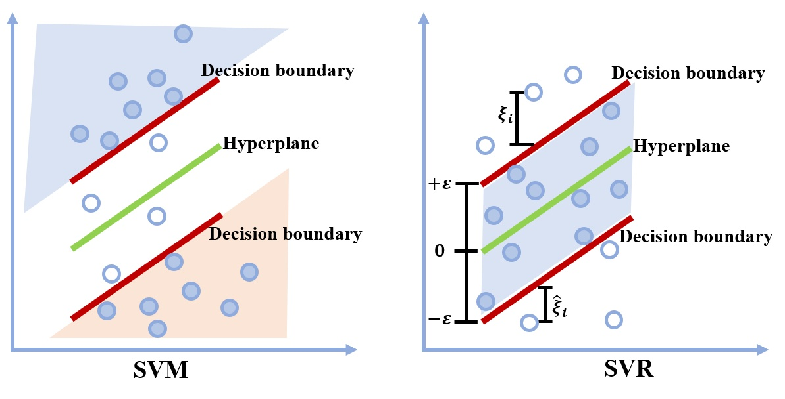
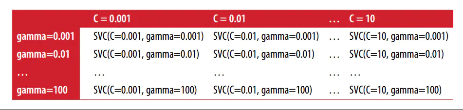

# 机器学习与sk-learn

## 1.L1正则化（Regularization）与L2正则化

​		所谓的正则化就是在原来的*loss function*基础上加一项模型复杂度的惩罚项。模型的复杂度可以用*VC维*来衡量，VC维度越大，则学习过程越复杂。

优化目标：
$$
min_w||Xw-y||_2^2
$$
加L1正则化：
$$
min_w||Xw-y||_2^2+\alpha||w||_1
$$
加L2正则化：
$$
min_w||Xw-y||_2^2+\alpha||w||_2^2
$$


​		VC 维是衡量函数类的复杂度的一种方式，通过**评估函数类中函数的弯曲程度**实现。在平面中，存在两类点，一类点类别为0，另一类为1。如果VC维等于3，即平面任意3个点总能被一条直线分开，4个点却不行。**一般地**，***p***维线性指示函数VC维为***p+1***。


​		下图是无穷VC维，对于实轴上的任意多个点，总存在一个函数能将他们分开。


### 1.1 从结构风险最小化角度

​		结构风险最小化（Structural Risk Minimizatiom）的基本思想是在保证**分类精度(经验风险)**时，降低模型的VC维才能取得较小的实际风险，即对未来的样本有较好的推广性。以w1和w2组成的解的空间为例：


对于L1正则化，如右图所示：

- 优化需要同时最小化两项。如果不加L1正则化得话，优化结果为圆圈内部紫色的部分。对于w1和w2来说，值域所围成的形状为菱形（|w1|+|w2|=F）。对于红色曲线，每一点都可以做一个菱形(曲线上每个w1,w2的取值都可以确定一个以原点为中心的菱形)。由图可见，当w2=0时候，两参数确定的菱形最小。**这也是L1更容易得到稀疏解得原因。**


- L2正则化同理，不过L2正则化不容易交于坐标轴上，但值仍然会靠近坐标轴。


### 1.2 从概率论的角度

​		**L1服从拉普拉斯分布，L2服从高斯分布。**（具体原因看链接）

​		先验就是优化的起跑线, 有先验的好处就是可以在较小的数据集中有良好的泛化性能，当然这是在先验分布是接近真实分布的情况下得到的了，从信息论的角度看，向系统加入了正确先验这个信息，肯定会提高系统的性能。

拉普拉斯分布：
$$
f(x)=\frac{1}{2\lambda}e^{-\frac{|x-\mu|}{\lambda}},\lambda，\mu为常数，且\lambda为常数
$$

​		如果ω服从标准拉普拉斯分布，那么ω取0的概率非常大。


​                            	

​		如果ω服从标准高斯分布，那么ω取0附近值的概率非常大。


### 1.3 总结

​		正则化能够降低模型的结构风险，通俗来说就是将模型变得相对简单，这符合*奥卡姆剃刀*理论。

​		L1正则化就是在loss function后边所加正则项为L1范数，加上L1范数容易得到稀疏解（0比较多）。L2正则化就是loss function后边所加正则项为L2范数的平方，加上L2正则相比于L1正则来说，得到的解比较平滑（不是稀疏），但是同样能够保证解中接近于0（但不是等于0，所以相对平滑）的维度比较多，降低模型的复杂度。

​		

## 2.回归（Regression）

​		*回归，事物总是朝着某种**平均**发展，也可以说是朝着事物得某种本来得面目发展。*

### 2.1 什么是回归

​		回归是一种建立预测模型的方法，这种方法常用于预测分析，时间序列模型以及变量之间的因果关系。在回归任务中，计算机程序需要对给定输入预测输出数值。*除了返回结果的形式不一样外，这类问题和分类问题是很像的。***若我们预测的是离散值，此类任务为`分类`，若我们预测的是连续值，此类任务为`回归`**

### 2.2 回归模型[^1]

​		常用的回归模型有`线性回归（Linear Regression）`,`岭回归（Ridge Regression）`,`LASSO回归`，`弹性网络（ElasticNet）`，`核岭回归（Kernel Ridge Regression,KRR）`(带有核函数的岭回归)，此外**logistics回归不是回归问题，而是分类问题**。

#### 2.2.1  广义线性模型

​		目标值$y$是输入变量$x$的线性组合。如果有有$\hat{y}$是预测值，则满足：
$$
\hat{y}(w,x)=w_0+w_1x_1+...+w_px_p
$$
可见，在线性方程中，$w=(w_1,...,w_p)$为系数（coef）向量，$w_0)$为截距。

​		线性回归模型通过`最小二乘法（Least Square）`来拟合$w=(w_1,...,w_p)$

的线性模型，使得数据集实际数据（labeled）和预测数据（估计值）之间的残差[^2]平方和最小，即
$$
min_w||Xw-y||_2^2
$$
普通最小二乘法的复杂度：设$$n_{samples} \geq n_{features}$$,则复杂度为$$O(n_{samples} n_{fearures}^2)$$

```python
from sklearn import  linear_model
x=[[0,0],[1,1],[2,2]]
y=[0,1,2]
model=linear_model.LinearRegression()
#使用fit拟合
model.fit(x,y)
#w=（w1,w2,...,wn）存在cofe_中
print(model.coef_)
#w0，截距存在intercept_中
print(model.intercept_)
```

### 2.2.1 岭回归

​		岭回归就是**L2正则化**，岭系数最小化的是带罚项的残差平方和。$\alpha$的值越大，由于L2正则化是迫使$w$趋于标准正态分布，$w$越趋于标准正态分布。下图[^3]显示了岭系数（Ridge coefficient）对正则化的 影响，每个颜色代表系数向量$w$的不同特征。

​		当$\alpha$非常大时，正则化效应会主导平方损失函数，系数趋于零。在路径的末端，*随着α趋向于零，解趋向于普通最小二乘，系数呈现大的振荡。***在实际工作中，有必要对$\alpha$进行调整，使两者之间保持平衡。**
$$
min_w||Xw-y||_2^2+\alpha||w||_2^2
$$


​		这个例子还显示了将Ridge回归用于`病态矩阵`的有用性。**对于病态矩阵（ill-conditioned matrix）[^4]，输入数据较小的波动，得到的结果会具有很大的波动。**在这种情况下，设置一定的正则化系数来减少这种变异（噪声）是很有用的。

使用如下代码实现上图：

```python
# Author: Fabian Pedregosa -- <fabian.pedregosa@inria.fr>
# License: BSD 3 clause

print(__doc__)

import numpy as np
import matplotlib.pyplot as plt
from sklearn import linear_model

# X is the 10x10 Hilbert matrix
X = 1. / (np.arange(1, 11) + np.arange(0, 10)[:, np.newaxis])
y = np.ones(10)

# #############################################################################
# Compute paths

n_alphas = 200
alphas = np.logspace(-10, -2, n_alphas)

coefs = []
for a in alphas:
    ridge = linear_model.Ridge(alpha=a, fit_intercept=False)
    ridge.fit(X, y)
    coefs.append(ridge.coef_)

# #############################################################################
# Display results

ax = plt.gca()

ax.plot(alphas, coefs)
ax.set_xscale('log')
ax.set_xlim(ax.get_xlim()[::-1])  # reverse axis
plt.xlabel('alpha')
plt.ylabel('weights')
plt.title('Ridge coefficients as a function of the regularization')
plt.axis('tight')
plt.show()
```

使用如下代码实现岭回归：

```python
from sklearn import linear_model
x=[[0,0],[1,1],[2,2]]
y=[0,1,2]
model=linear_model.Ridge(alpha=0.5)
model.fit(x,y)
print(model.coef_)
print(model.intercept_)
```

### 2.2.2 LASSO回归

​		LASSO,全称 Least Absolute Shrinkage and Selection Operator,该方法是一种压缩估计。通过加入L1正则化项来迫使一些回归系数$w$归为0,使得模型稀疏化，这意味着LASSO模型是一种较小的模型，在新的数据上也拥有较小的方差。
$$
min_w||Xw-y||_1
$$
LASSO类的实现使用了`坐标下降算法`。

​		**LASSO用于稀疏数据的效果较好**

​		使用不同的惩罚项(penalization)来重建CT图像[^5]：



使用 L1 惩罚的重建给出了一个零误差的结果（所有像素都成功地被标记为 0 或 1），即使在投影中加入了噪声。相比之下，L2惩罚(sklearn.linear_model.Ridge)会对像素产生大量的标注错误。与L1惩罚化相反，在重建的图像上观察到了重要的伪影。特别要注意在角落里分离像素的圆形伪影，这些伪影造成了比中心盘更少的投影。

使用如下代码实现：

```python
from sklearn import linear_model
x=[[0,0],[1,1],[2,2]]
y=[0,1,2]
model=linear_model.Lasso(alpha=0.5)
model.fit(x,y)
print(model.coef_)
print(model.intercept_)
```


### 2.2.3 弹性网络

​		弹性网络使用L1,L2范数作为先验正则项来训练线性回归模型，这种组合可以拟合**一个只有少量参数是非零的稀疏模型**，就像LASSO一样，但它仍然保持了一些类似于岭回归的正则性质。我们可以使用变量`l1_ratio`来控制L1和L2的`凸`线性组合。最小化的目标函数是：
$$
min_w\frac{1}{2n_{samples}}||Xw-y||_2^2+\alpha\rho||w||_1+\frac{\alpha(1-\rho)}{2}||w||_2^2
$$
​		弹性网络的两种正则化的组合一方面达到了LASSO缩减模型的效果，另一方面弹性网络在预测多个相关特征时候比LASSO更好。Lasso 很可能只随机考虑这些特征中的一个，而弹性网络更倾向于选择两个。

```python
from sklearn import linear_model
x=[[0,0],[1,1],[2,2]]
y=[0,1,2]
model=linear_model.ElasticNet(alpha=0.5,l1_ratio=0.5)
model.fit(x,y)
print(model.coef_)
print(model.intercept_)
```


## 3. 回归指标[^6]

​		*一个随机变量的**方差**描述的是它的离散程度，也就是该变量与期望值的距离。*
$$
\sigma^2=\frac{\sum(X-\mu)}{N}
$$

### 3.1 可解释方差（Explained Variance Score）

​		如果$\hat{y}$是预估的目标输出，$y$是相应的正确的目标输出，$Var$是方差，那么可解释方差定义如下：
$$
explained\_variance(y,\hat{y})=1-\frac{Var\{y-\hat{y}\}}{Var\{y\}}
$$
​		根据公式，**可解释方差为1最好，值越低越差。**

​		当$Var\{y-\hat{y}\}=0$时，即全部预测对，也即可解释方差值为1，模型表现最好。

​		**可解释方差能有负值**

```python
from sklearn.metrics import explained_variance_score
# 可解释方差
y_true=[3,-0.5,2,7]
y_pred=[-10,0.0,0,10]
print(explained_variance_score(y_true,y_pred))
print(explained_variance_score(y_true,y_pred,multioutput='raw_values'))
-->-4.1113490364025695
-->[-4.11134904]
```


### 3.2 $R^2$评分

​		也叫判定系数（coefficient of determination）,也叫可决系数、决定系数。指**在线性模型中，回归平方和[^7]与总离差平方和[^8]之比值，其数值等于相关系数的平方。**
$$
R^2\_score=1-\frac{\sum_{i=1}^n\{y_i-\hat{y_i}\}^2}{\sum_{i=1}^n\{y_i-\bar{y}\}^2} \\
\bar{y}=\frac{\sum_{i=1}^ny_i}{n_{samples}}
$$
​		**当$R^2$评分值为1时，模型越好。**

​		**同样，$R^2$也能为负值。**

​	

```python
from sklearn.metrics import explained_variance_score,r2_score
y_true=[3,-0.5,2,7]
y_pred=[3,0.5,2,7]
print(r2_score(y_true,y_pred))
print(r2_score(y_true,y_pred,multioutput='raw_values'))
-->-5.244111349036403
-->[-5.24411135]
```


### 3.3均方误差和平均绝对误差

均方误差（Mean Square Error）
$$
MSE(y,\hat{y})=\frac{1}{n_{samples}}\sum_{i=0}^{n_{samples}-1}(y_i-\hat{y_i})^2
$$
平均绝对误差（Mean Absolute Error）


$$
MSE(y,\hat{y})=\frac{1}{n_{samples}}\sum_{i=0}^{n_{samples}-1}|y_i-\hat{y_i}|
$$

```python
from sklearn.metrics import mean_squared_error,mean_absolute_error
y_true=[3,-0.5,2,7]
y_pred=[-10,0.0,0,10]
print(mean_squared_error(y_true,y_pred))
print(mean_absolute_error(y_true,y_pred))
-->45.5625
-->4.625
```


## 4. SVM与SVR

​		SVM(Support Vector Machine),支持向量机。**是一种二分类模型**，它的基本模型是定义在**特征空间**，如下图$x$特征和$y$特征组成的二维特征空间，**间隔最大的线超平面($\frac{2}{||w||}$最大）**。SVM还可以使用**核技巧**使之成为非线性分类器。

### 4.1 拉格朗日乘子法

​		是一种**寻找变量受一个或多个条件所限制的多元函数极值的方法**。**该方法将以个有$n$个变量与$k$个约束条件的最优化问题转换为一个有$n+k$变量的方程组的极值问题，使其变量不受任何约束**

定义：

​		倘若二元函数，$z=f(x,y)$，和附加条件$g(x,y)=c$，寻找$z=f(x,y)$在附加条件下的极值点，即$z'=0$。

​		先构建拉格朗日函数$F(x,y,\lambda)=f(x,y)+\lambda g(x,y)$,令$F$对$x,y,\lambda$（拉格朗日乘子）的一阶偏导等于零，即：
$$
F_x=f_x(x,y)+\lambda g_x(x,y)=0\\
F_y=f_y(x,y)+\lambda g_y(x,y)=0\\
F_\lambda=g(x,y)=c
$$
由上述方程解出$x,y，\lambda$，如此求得的$x,y$就是函数$z=f(x,y)$在附加条件$\phi(x,y)=0$下可能的极值点。

​	



### 4.2 SVM

​		如下图所示，设超平面关于样本点的**几何间隔**[^9]为：

![[公式]](https://www.zhihu.com/equation?tex=+%5Cgamma+_i%3Dy_i%5Cleft%28+%5Cfrac%7B%5Cboldsymbol%7Bw%7D%7D%7B%5ClVert+%5Cboldsymbol%7Bw%7D+%5CrVert%7D%5Ccdot+%5Cboldsymbol%7Bx%7D_%7B%5Cboldsymbol%7Bi%7D%7D%2B%5Cfrac%7Bb%7D%7B%5ClVert+%5Cboldsymbol%7Bw%7D+%5CrVert%7D+%5Cright%29+)

那么样本到超平面的最小几何间隔为：
$$
\gamma=min_{i=1,2,...,n}\gamma_i
$$


**SVM训练分类器的算法是：寻找超平面，使正负样本都在超平面两侧，且样本到超平面的几何间隔最大，**数学描述如下：
$$
max_{w,b}  \ \gamma\\
s.t.\  y_i(\frac{w}{||w||}x_i+\frac{b}{||w||}) \ge\gamma
$$
又因为最大化 ![[公式]](https://www.zhihu.com/equation?tex=+%5Cgamma+) ，等价于最大化 ![[公式]](https://www.zhihu.com/equation?tex=+%5Cfrac%7B1%7D%7B%5ClVert+%5Cboldsymbol%7Bw%7D+%5CrVert%7D) ，也就等价于最小化 ![[公式]](https://www.zhihu.com/equation?tex=+%5Cfrac%7B1%7D%7B2%7D%5ClVert+%5Cboldsymbol%7Bw%7D+%5CrVert+%5E2+) （ ![[公式]](https://www.zhihu.com/equation?tex=%5Cfrac%7B1%7D%7B2%7D) 是为了后面求导以后形式简洁，不影响结果），因此SVM模型的求解最大分割超平面问题又可以表示为以下约束最优化问题

![[公式]](https://www.zhihu.com/equation?tex=+%5Cunderset%7B%5Cboldsymbol%7Bw%2C%7Db%7D%7B%5Cmin%7D%5C+%5Cfrac%7B1%7D%7B2%7D%5ClVert+%5Cboldsymbol%7Bw%7D+%5CrVert+%5E2+)

![[公式]](https://www.zhihu.com/equation?tex=+s.t.%5C+%5C+y_i%5Cleft%28+%5Cboldsymbol%7Bw%7D%5Ccdot+%5Cboldsymbol%7Bx%7D_%7B%5Cboldsymbol%7Bi%7D%7D%2Bb+%5Cright%29+%5Cge+1%2C%5C+i%3D1%2C2%2C...%2CN+)

将有约束的原始目标函数转换为无约束的新构造的拉格朗日目标函数:

![[公式]](https://www.zhihu.com/equation?tex=L%5Cleft%28+%5Cboldsymbol%7Bw%2C%7Db%2C%5Cboldsymbol%7B%5Calpha+%7D+%5Cright%29+%3D%5Cfrac%7B1%7D%7B2%7D%5ClVert+%5Cboldsymbol%7Bw%7D+%5CrVert+%5E2-%5Csum_%7Bi%3D1%7D%5EN%7B%5Calpha+_i%5Cleft%28+y_i%5Cleft%28+%5Cboldsymbol%7Bw%7D%5Ccdot+%5Cboldsymbol%7Bx%7D_%7B%5Cboldsymbol%7Bi%7D%7D%2Bb+%5Cright%29+-1+%5Cright%29%7D+)

~~对于二分类问题，$y(wx+b)>0$意味着分类正确，且值越大，分类的确信度越大。~

可通过如下代码实现：

```python
#鸢尾花分类
import numpy as np
from sklearn import svm
import  matplotlib.pyplot  as plt
from sklearn import datasets

iris=datasets.load_iris()
data,target=iris["data"],iris["target"]
x=np.array([data[:,0]]).reshape(150,-1)
y=np.array([data[:,1]]).reshape(150,-1)
data=np.concatenate((x,y),axis=1)
target=np.where(target>=1,1,0)

for i in range(len(target)):
    if target[i]==1:
        plt.scatter(x[i],y[i],color='black')
    else:
        plt.scatter(x[i],y[i],color='red')
model=svm.SVC(C=15,kernel='linear')
# C为惩罚因子，C越大，模型越容易过拟合
model.fit(data,target)
# 获取支持向量
sv=model.support_vectors_
x1=sv[:,0]
y1=sv[:,1]
plt.scatter(x1,y1,color='',marker='o',edgecolors='g',s=100)
plt.show()

```


### 4.3 SVR

​		SVR的优化方向：
$$
min_w\frac{1}{2}||w||^2\\
s.t. y_i-w^tx_i-b\le\epsilon\\
	w^tx_i+b-y_i\le\epsilon
$$
由公式可知，SVR只对间隔外（$\epsilon$）的样本进行惩罚，当样本点位于间隔内饰，不计算损失。这样做的结果是越来越多的点落在间隔内





## 5.  分类指标

### 5.1 混淆矩阵

`from sklearn.metrics import confusion_matrix`

```python
confusion_matrix(y_true, y_pred, labels=None, sample_weight=None,
                 normalize=None)
```

| 真实\预测 | 正例         | 负例         |
| :-------: | ------------ | ------------ |
|   正例    | 真正例（TP） | 假负例（FN） |
|   负例    | 假正例（FP） | 真负例（TN） |


### 5.2 准确率(accuarcy)

​		`from sklearn.metrics import accuary_score `

以下面公式计算得到：
$$
accuracy=\frac{TP+TN}{TP+FP+TN+FN}
$$
即计算的是**预测对的样例占总样本的比值**


### 5.3 精确度（查准率，precision）

​	`from sklearn.metircs import precision_score`

以下公式得到：
$$
precision=\frac{TP}{TP+FP}
$$
即**以正例为参考指标，计算模型找到的真正例与找到的所有的正例之比，即找对正例的能力。**


### 5.4 召回率（查全率，recall）

`from sklearn.metrics import recall_score`

以下公式计算得到：
$$
recall=\frac{TP}{TP+FN}
$$
即**以正例做参考，计算模型找到正例与所有正例的之比，即找回正例的能力**


### 5.5 F1得分（F1-score）

`from sklearn.metrics import f1_score`

以下公式计算得到：
$$
f1-score=2*\frac{precision*recall}{precision+recall}
$$
即**是精确度和召回率的调和，如果只有一个高，那么f1得分也会低，两个都高,f1得分高**


## 6. 模型评估[^10]

​		从`sklearn.metrics`中调用

|                                |                                                              |                                                           |
| :----------------------------- | :----------------------------------------------------------: | --------------------------------------------------------- |
| Scoring                        |                           Function                           | Comment                                                   |
| **Classification**             |                                                              |                                                           |
| **‘accuracy’**                 | [`metrics.accuracy_score`](https://scikit-learn.org/stable/modules/generated/sklearn.metrics.accuracy_score.html#sklearn.metrics.accuracy_score) |                                                           |
| ‘balanced_accuracy’            | [`metrics.balanced_accuracy_score`](https://scikit-learn.org/stable/modules/generated/sklearn.metrics.balanced_accuracy_score.html#sklearn.metrics.balanced_accuracy_score) |                                                           |
| ‘average_precision’            | [`metrics.average_precision_score`](https://scikit-learn.org/stable/modules/generated/sklearn.metrics.average_precision_score.html#sklearn.metrics.average_precision_score) |                                                           |
| ‘neg_brier_score’              | [`metrics.brier_score_loss`](https://scikit-learn.org/stable/modules/generated/sklearn.metrics.brier_score_loss.html#sklearn.metrics.brier_score_loss) |                                                           |
| **‘f1’**                       | [`metrics.f1_score`](https://scikit-learn.org/stable/modules/generated/sklearn.metrics.f1_score.html#sklearn.metrics.f1_score) | 二分类                                                    |
| **‘f1_micro’**                 | [`metrics.f1_score`](https://scikit-learn.org/stable/modules/generated/sklearn.metrics.f1_score.html#sklearn.metrics.f1_score) | micro-averaged，多分类,通过先计算总体的TP,FN,FP，在计算f1 |
| **‘f1_macro’**                 | [`metrics.f1_score`](https://scikit-learn.org/stable/modules/generated/sklearn.metrics.f1_score.html#sklearn.metrics.f1_score) | macro-averaged，多分类,先计算每个类的f1,然后平均          |
| **‘f1_weighted’**              | [`metrics.f1_score`](https://scikit-learn.org/stable/modules/generated/sklearn.metrics.f1_score.html#sklearn.metrics.f1_score) | weighted average，多分类                                  |
| ‘f1_samples’                   | [`metrics.f1_score`](https://scikit-learn.org/stable/modules/generated/sklearn.metrics.f1_score.html#sklearn.metrics.f1_score) | by multilabel sample                                      |
| ‘neg_log_loss’                 | [`metrics.log_loss`](https://scikit-learn.org/stable/modules/generated/sklearn.metrics.log_loss.html#sklearn.metrics.log_loss) | requires `predict_proba` support                          |
| **‘precision’ etc.**           | [`metrics.precision_score`](https://scikit-learn.org/stable/modules/generated/sklearn.metrics.precision_score.html#sklearn.metrics.precision_score) | suffixes apply as with ‘f1’                               |
| **‘recall’ etc.**              | [`metrics.recall_score`](https://scikit-learn.org/stable/modules/generated/sklearn.metrics.recall_score.html#sklearn.metrics.recall_score) | suffixes apply as with ‘f1’                               |
| ‘jaccard’ etc.                 | [`metrics.jaccard_score`](https://scikit-learn.org/stable/modules/generated/sklearn.metrics.jaccard_score.html#sklearn.metrics.jaccard_score) | suffixes apply as with ‘f1’                               |
| ‘roc_auc’                      | [`metrics.roc_auc_score`](https://scikit-learn.org/stable/modules/generated/sklearn.metrics.roc_auc_score.html#sklearn.metrics.roc_auc_score) |                                                           |
| ‘roc_auc_ovr’                  | [`metrics.roc_auc_score`](https://scikit-learn.org/stable/modules/generated/sklearn.metrics.roc_auc_score.html#sklearn.metrics.roc_auc_score) |                                                           |
| ‘roc_auc_ovo’                  | [`metrics.roc_auc_score`](https://scikit-learn.org/stable/modules/generated/sklearn.metrics.roc_auc_score.html#sklearn.metrics.roc_auc_score) |                                                           |
| ‘roc_auc_ovr_weighted’         | [`metrics.roc_auc_score`](https://scikit-learn.org/stable/modules/generated/sklearn.metrics.roc_auc_score.html#sklearn.metrics.roc_auc_score) |                                                           |
| ‘roc_auc_ovo_weighted’         | [`metrics.roc_auc_score`](https://scikit-learn.org/stable/modules/generated/sklearn.metrics.roc_auc_score.html#sklearn.metrics.roc_auc_score) |                                                           |
| **Clustering**                 |                                                              |                                                           |
| ‘adjusted_mutual_info_score’   | [`metrics.adjusted_mutual_info_score`](https://scikit-learn.org/stable/modules/generated/sklearn.metrics.adjusted_mutual_info_score.html#sklearn.metrics.adjusted_mutual_info_score) |                                                           |
| ‘adjusted_rand_score’          | [`metrics.adjusted_rand_score`](https://scikit-learn.org/stable/modules/generated/sklearn.metrics.adjusted_rand_score.html#sklearn.metrics.adjusted_rand_score) |                                                           |
| ‘completeness_score’           | [`metrics.completeness_score`](https://scikit-learn.org/stable/modules/generated/sklearn.metrics.completeness_score.html#sklearn.metrics.completeness_score) |                                                           |
| ‘fowlkes_mallows_score’        | [`metrics.fowlkes_mallows_score`](https://scikit-learn.org/stable/modules/generated/sklearn.metrics.fowlkes_mallows_score.html#sklearn.metrics.fowlkes_mallows_score) |                                                           |
| ‘homogeneity_score’            | [`metrics.homogeneity_score`](https://scikit-learn.org/stable/modules/generated/sklearn.metrics.homogeneity_score.html#sklearn.metrics.homogeneity_score) |                                                           |
| ‘mutual_info_score’            | [`metrics.mutual_info_score`](https://scikit-learn.org/stable/modules/generated/sklearn.metrics.mutual_info_score.html#sklearn.metrics.mutual_info_score) |                                                           |
| ‘normalized_mutual_info_score’ | [`metrics.normalized_mutual_info_score`](https://scikit-learn.org/stable/modules/generated/sklearn.metrics.normalized_mutual_info_score.html#sklearn.metrics.normalized_mutual_info_score) |                                                           |
| ‘v_measure_score’              | [`metrics.v_measure_score`](https://scikit-learn.org/stable/modules/generated/sklearn.metrics.v_measure_score.html#sklearn.metrics.v_measure_score) |                                                           |
| **Regression**                 |                                                              |                                                           |
| **‘explained_variance’**       | [`metrics.explained_variance_score`](https://scikit-learn.org/stable/modules/generated/sklearn.metrics.explained_variance_score.html#sklearn.metrics.explained_variance_score) |                                                           |
| ‘max_error’                    | [`metrics.max_error`](https://scikit-learn.org/stable/modules/generated/sklearn.metrics.max_error.html#sklearn.metrics.max_error) |                                                           |
| ‘neg_mean_absolute_error’      | [`metrics.mean_absolute_error`](https://scikit-learn.org/stable/modules/generated/sklearn.metrics.mean_absolute_error.html#sklearn.metrics.mean_absolute_error) |                                                           |
| ‘neg_mean_squared_error’       | [`metrics.mean_squared_error`](https://scikit-learn.org/stable/modules/generated/sklearn.metrics.mean_squared_error.html#sklearn.metrics.mean_squared_error) |                                                           |
| ‘neg_root_mean_squared_error’  | [`metrics.mean_squared_error`](https://scikit-learn.org/stable/modules/generated/sklearn.metrics.mean_squared_error.html#sklearn.metrics.mean_squared_error) |                                                           |
| ‘neg_mean_squared_log_error’   | [`metrics.mean_squared_log_error`](https://scikit-learn.org/stable/modules/generated/sklearn.metrics.mean_squared_log_error.html#sklearn.metrics.mean_squared_log_error) |                                                           |
| ‘neg_median_absolute_error’    | [`metrics.median_absolute_error`](https://scikit-learn.org/stable/modules/generated/sklearn.metrics.median_absolute_error.html#sklearn.metrics.median_absolute_error) |                                                           |
| **‘r2’**                       | [`metrics.r2_score`](https://scikit-learn.org/stable/modules/generated/sklearn.metrics.r2_score.html#sklearn.metrics.r2_score) |                                                           |
| ‘neg_mean_poisson_deviance’    | [`metrics.mean_poisson_deviance`](https://scikit-learn.org/stable/modules/generated/sklearn.metrics.mean_poisson_deviance.html#sklearn.metrics.mean_poisson_deviance) |                                                           |
| ‘neg_mean_gamma_deviance’      | [`metrics.mean_gamma_deviance`](https://scikit-learn.org/stable/modules/generated/sklearn.metrics.mean_gamma_deviance.html#sklearn.metrics.mean_gamma_deviance) |                                                           |

用法举例:

```python
from sklearn import svm,datasets
from sklearn.metrics import f1_score,classification_report
from sklearn import  model_selection
# 数据处理
Data=datasets.load_iris()
data=Data['data']
target=Data['target']

train_data,test_data,train_target,test_target=model_selection.train_test_split(data,target,random_state=0,test_size=0.1)
# 模型训练
clf=svm.SVC()
clf.fit(train_data,train_target)
# 模型评估
pred=clf.predict(test_data)
print(test_target)
print(pred)
print(f1_score(test_target,pred,average='micro'))
print(classification_report(test_target,pred))
-->[2 1 0 2 0 2 0 1 1 1 2 1 1 1 1]
-->[2 1 0 2 0 2 0 1 1 1 2 1 1 1 1]
-->1.0
-->              precision    recall  f1-score   support

           0       1.00      1.00      1.00        14
           1       1.00      0.93      0.96        14
           2       0.91      1.00      0.95        10

    accuracy                           0.97        38
   macro avg       0.97      0.98      0.97        38
weighted avg       0.98      0.97      0.97        38
```


## 7. 数据预处理

1. 明确特征类型（离散，连续）
2. 缺失值补完[不上没有意义的数字，NaN]
3. 标准化 N（0，1）,**将正态分布数据变为标准正态分布数据**。$N(0,1)=\frac{N(\mu,\sigma^2)-\mu}{\sigma}$
4. 对类别数据进行one-hot编码
5. 将需要转换成类别类型的数据进行二值化
6. 正则化防过拟合
7. 尝试多项式方法，寻找非线性关系 
8. 根据实际问题分析是否对特征进行相应转换，（词向量）

### 7.1 标准化（Standardization）

​		许多模型和算法（RBF,SVM,L1,L2）都假设每个特征满足中心极限定理。**如果一个特征的方差比其他任何特征的方差都大，它会可能*主导*目标函数，使得Estimator不能如期从其他特征中正确学习。**

​		**如果特征是一个稀疏矩阵，那么特征矩阵将不再稀疏，数据变质。**

1. 中心化（将均值变为0）

2. 方差规模化（将方差变为1）	

   

对数据进行标准化：

`preprocessing.scale(data)`

```python
from sklearn import preprocessing
import  numpy as np
X_train=np.array([[1.,-1,2],
                  [2.,0,0],
                  [0,1,-1.]])
x_sacled=preprocessing.scale(X_train)
print(x_sacled)
-->[[ 0.         -2.44948974  1.33630621]
 [ 1.22474487  0.          0.53452248]
 [-1.22474487  2.44948974 -1.87082869]]
```

`preprocessing`模块提供了`StandardScaler`来计算$\sigma,\mu$。通过这个方法可以将变换测试集后来**变换测试集**,这样可以确保训练集和测试集在同一个分布上。

```python
from sklearn import preprocessing
import  numpy as np

X_train=np.array([[1.,-1,2],
                  [2.,0,0],
                  [0,1,-1.]])
y_train=np.array([[1.,-2,2],
                  [2.,0,1],
                  [0,2,-2.]])
scaler=preprocessing.StandardScaler().fit(X_train)
y_train=scaler.transform(y_train)
print(y_train)
-->[[ 0.         -2.44948974  1.33630621]
 [ 1.22474487  0.          0.53452248]
 [-1.22474487  2.44948974 -1.87082869]]
```

### 

### 7.2 归一化（Normalization）

​		`sklearn.preprocessing.normalize(X,norm='l2',axis=1)`

​		归一化将数据按比例缩放，使之落入一个小的特定区间，**去除数据的单位限制，将其转化为无量纲的纯数（量纲为1？）；提升模型收敛速度；提高模型精度**

```python
X_norm1=preprocessing.normalize(X_train,norm='l2')
print(X_norm1)
X_norm2=preprocessing.normalize(X_train,norm='l1')
print(X_norm2)
X_norm3=preprocessing.normalize(X_train,norm='max')
print(X_norm3)
-->[[ 0.40824829 -0.40824829  0.81649658]
 [ 1.          0.          0.        ]
 [ 0.          0.70710678 -0.70710678]]
-->[[ 0.25 -0.25  0.5 ]
 [ 1.    0.    0.  ]
 [ 0.    0.5  -0.5 ]]
-->[[ 0.5 -0.5  1. ]
 [ 1.   0.   0. ]
 [ 0.   1.  -1. ]]

Process finished with exit code 0

```

​		同标准化一样，`preprocessing`模块也提供了`Normalizer`来通过`Transformer`API来对不同的数据集进行同一种变换。

```python
normalizer=preprocessing.Normalizer().fit(X_train)
print(normalizer.transform(y_train))
-->[[ 0.         -0.87786229  0.47891314]
 [ 0.91651514  0.          0.4       ]
 [-0.36927447  0.73854895 -0.56407607]]
```


### 7.3 缺失值处理

`from sklearn.impute import SimpleImputer`

​		sklearn模型中，**默认输入的数据都是有意义的，如果有缺失数据NaN，则无法识别和计算。**缺失值**必须设置为NaN,可以通过np.nan实现。**

​		补全策略：

1. `mean`，使用均值替换
2. `median`,使用中位数替换
3. `most_frequent`，使用出现频率最高的替换
4. `constant`，使用给定的常数替换

```python
from sklearn.impute import SimpleImputer
imp1=SimpleImputer(missing_values=np.nan,strategy='mean')
y_imp1=imp1.fit_transform([[np.nan,2],[6,np.nan],[7,6]])
print(y_imp1)
imp2=SimpleImputer(missing_values=np.nan,strategy='most_frequent')
y_imp2=imp2.fit_transform([[np.nan,2],[6,np.nan],[7,6]])
print(y_imp2)
```


## 8. 决策树、回归树

待补充。2020-7-8


## 9.网格搜索(Grid Search)[^11]

​		网格搜索是一种**调参**手段，使用**穷举**搜索。在所有的候选参数选择中，通过**循环遍历**（for i in []:for j in []:）尝试每一种可能。以调参数**C**和参数**gamma**为例。



```python
best_score = 0
for gamma in [0.001,0.01,0.1,1,10,100]:
    for C in [0.001,0.01,0.1,1,10,100]:
        svm = SVC(gamma=gamma,C=C)#对于每种参数可能的组合，进行一次训练；gamma是SVC核系数，C是SVC正则化参数
        svm.fit(X_train,y_train)
        score = svm.score(X_test,y_test)
        if score > best_score:#找到表现最好的参数
            best_score = score
            best_parameters = {'gamma':gamma,'C':C}
```

​		`sklearn`中使用`GridSearchCV`来实现网格搜索。`CV`指交叉验证，即`Grid Search with Cross Validation`。`cv=None`时默认使用**``cv=5``**,5折交叉验证

```python
class sklearn.model_selection.GridSearchCV(estimator, param_grid, *, scoring=None, n_jobs=None, iid='deprecated', refit=True, cv=None, verbose=0, pre_dispatch='2*n_jobs', error_score=nan, return_train_score=False)
```

实现类似于：

**可以使用如下代码在pytorch中实现网格搜索**

```python
best_score=0
for gamma in [0.001,0.01,1,10,100]:
    for C in [0.001,0.01,1,10,100]:
        svc=SVC(gamma=gamma,C=C)#gamma是核系数，C是正则化参数
        #5折交叉验证
        scores=cross_val_score(svc,X_trainval,y_trainval,cv=5) #5-fold交叉验证
        print(scores)#-->[0.34782609 0.34782609 0.36363636 0.36363636 0.40909091]
        score=scores.mean()
        #找到表现最好的参数
        if score > best_score:
            best_score=score
            best_parameters={'gamma':gamma,'C':C}
print(best_parameters)
```

使用GridSearchCV:

```python
# 使用GridSearchCV
param_grid={'gamma':[i for i in np.arange(0.1,10,0.01)],'C':[i for i in np.arange(0.1,100,1)]}
grid_search=GridSearchCV(SVC(),param_grid,cv=6,n_jobs=-1)
grid_reult=grid_search.fit(X_trainval,y_trainval)#运行网格搜索
print(grid_reult.best_score_)
print(grid_reult.best_params_)
```


## x. scikit-learn


### x.1 使用sklearn构建机器学习模型的基本步骤

```python
from sklearn import  neighbors,datasets,preprocessing
from sklearn.model_selection import train_test_split
from sklearn.metrics import accuracy_score
from sklearn.model_selection import  cross_val_score

# 加载数据
iris=datasets.load_iris()

# 划分训练集和测试集
x,y=iris.data,iris.target
x_train,x_test,y_train,y_test=train_test_split(x,y,random_state=33)
# x_train,x_test,y_train,y_test=train_test_split(x,y,test_size=0.3
#  radom_state是随机种子

# 数据预处理
scaler=preprocessing.StandardScaler().fit(x_train)
# 根据x_train得到scaler--标准化的方法

#标准化，即标准正态分布化
x_train=scaler.transform(x_train)
x_test=scaler.transform(x_test)

# 创建模型
knn=neighbors.KNeighborsClassifier(n_neighbors=5)

# 模型拟合
knn.fit(x_train,y_train)

# 交叉验证
scores=cross_val_score(knn,x_train,y_train,cv=5,scoring="accuracy")
print(scores)
print(scores.mean())

# 预测（使用）
y_pred=knn.predict(x_test)
# 评估
print(accuracy_score(y_test,y_pred))
```

### 

------

[^1]: http://www.scikitlearn.com.cn/0.21.3/2/

[^2]: 残差（residual）是指实际观测值与估计值（拟合值）之间的差。残差蕴含了有关模型基本假设的重要信息。如果回归模型正确的话， 我们可以将残差看作误差的观测值。利用残差所提供的信息，来考察模型假设的合理性及数据的可靠性称为残差分析。

[^3]: https://scikit-learn.org/stable/auto_examples/linear_model/plot_ridge_path.html
[^4]: https://blog.csdn.net/qq_18888869/article/details/82979590
[^5]: https://scikit-learn.org/stable/auto_examples/applications/plot_tomography_l1_reconstruction.html
[^6]: http://www.scikitlearn.com.cn/0.21.3/32/#334
[^7]: 回归平方和（ESS,Explained Sum of Squares）,$ESS=\sum\{\hat{y}-y\}^2$
[^8]: 离差平方和（SS,Sum of Squares of Debiations）,$SS=\sum\{x_i-\bar{x}\}^2$,反映了$x$与其数学期望$\bar{x}$的偏离程度。

[^9]:  https://www.zhihu.com/question/20466147 ↩https://zhuanlan.zhihu.com/p/31886934
[^10]: https://scikit-learn.org/stable/modules/model_evaluation.html#model-evaluation

[^11]: https://www.cnblogs.com/wj-1314/p/10422159.html


------

[sk-learn中文文档]：http://www.scikitlearn.com.cn/

[正则化]：https://zhuanlan.zhihu.com/p/35356992?utm_medium=social&utm_source=wechat_session

[VC维]https://www.zhihu.com/question/23418822/answer/299969908


[^4]: 